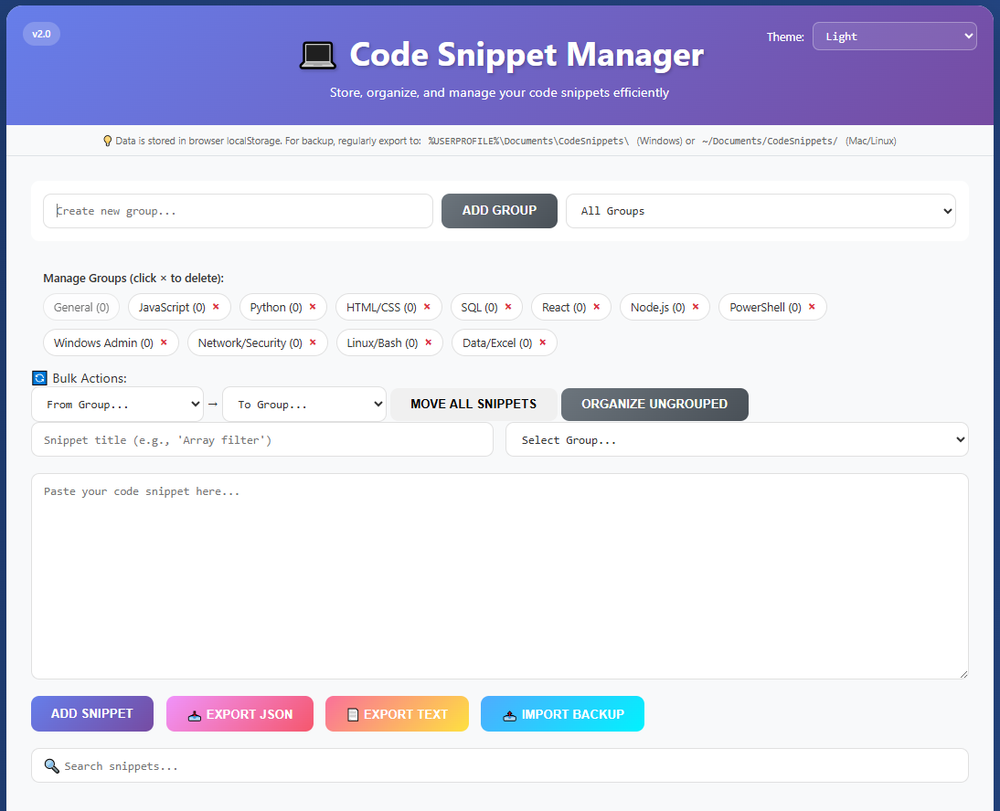

# code-snippet-manager
"Organize, Store, and Access Your Code Snippets Instantly"

[](https://github.com/astuk/code-snippet-manager)
[](LICENSE)
[](https://github.com/astuk/code-snippet-manager/pulls)
[](https://github.com/astuk/code-snippet-manager/commits/main)

A powerful, free, and open-source code snippet manager with a beautiful UI, dark mode, and advanced organization features. No signup required, no ads, just pure productivity.



## ✨ Features

### 🎨 **Multiple Themes**
- Light Mode - Clean and professional
- Dark Mode - Easy on the eyes
- Midnight Mode - Deep blue for late-night coding

### 📁 **Smart Organization**
- **Custom Groups** - Organize snippets by language, project, or any category
- **Bulk Operations** - Move multiple snippets between groups at once
- **Quick Group Assignment** - Change snippet groups with dropdown selectors
- **Protected Groups** - "General" group serves as default fallback

### 🔍 **Powerful Search & Filter**
- Real-time search across titles and code
- Filter by group
- Instant results highlighting

### 💾 **Data Management**
- **Import/Export** - JSON format for easy backup
- **Text Export** - Human-readable text format
- **Merge or Replace** - Flexible import options
- **Auto-save** - Changes saved instantly to browser localStorage

### ⚡ **Productivity Features**
- **Edit in Place** - Modify snippets without losing context
- **One-Click Copy** - Copy code to clipboard instantly
- **Keyboard Shortcuts** - Ctrl+Enter to save snippets
- **Timestamps** - Track creation and modification dates
- **Snippet Counter** - See statistics at a glance

### 🎯 **Developer Friendly**
- **No Backend Required** - Pure client-side application
- **No Dependencies** - Single HTML file with embedded CSS/JS
- **Responsive Design** - Works on desktop, tablet, and mobile
- **Cross-Browser Compatible** - Works in all modern browsers

## 🚀 Quick Start

### Option 1: Use Hosted Version
Visit: [https://connectedi.co.uk/snippet-manager](https://connectedi.co.uk/snippet-manager)

### Option 2: Download and Run Locally
1. Download `snippet-manager.html`
2. Open in any modern web browser
3. Start adding your snippets!

### Option 3: Host It Yourself
```bash
# Clone the repository
git clone https://github.com/astuk/code-snippet-manager.git

# Navigate to the directory
cd code-snippet-manager

# Open in browser (or host on any web server)
open snippet-manager.html
```

## 📖 Usage Guide

### Adding Snippets
1. Enter a title for your snippet
2. Select or create a group
3. Paste your code
4. Click "Add Snippet" or press `Ctrl+Enter`

### Managing Groups
- **Create Group**: Type name and click "Add Group"
- **Delete Group**: Click × next to group name (snippets move to General)
- **View Groups**: See all groups with snippet counts

### Organizing Existing Snippets
- **Individual**: Use dropdown on each snippet
- **Bulk Move**: Select source and destination groups
- **Quick Organize**: Move all ungrouped snippets to General

### Backup Your Data
1. Click "Export JSON" to save a backup
2. Store backups in `Documents/CodeSnippets/` (recommended)
3. Use "Import Backup" to restore or merge snippets

## 🛠️ Technical Details

### Technologies Used
- **HTML5** - Structure and semantic markup
- **CSS3** - Styling with CSS variables for theming
- **Vanilla JavaScript** - No framework dependencies
- **LocalStorage API** - Client-side data persistence

### Browser Support
- Chrome 60+
- Firefox 55+
- Safari 11+
- Edge 79+

### Data Storage
- All data stored locally in browser's localStorage
- No external servers or databases
- Data persists between sessions
- Domain-specific storage (hosted version)

## 📁 Default Groups

The manager comes with pre-configured groups for common languages:
- General (default, protected)
- JavaScript
- Python
- HTML/CSS
- SQL
- React
- Node.js
- PowerShell
- Windows Admin
- Network/Security
- Linux/Bash
- Data/Excel

## ⚙️ Configuration

### Customizing Groups
Edit the `groups` array in the JavaScript section:
```javascript
let groups = ['General', 'JavaScript', 'Python', 'YourCustomGroup'];
```

### Changing Themes
Add custom themes by defining new CSS variables:
```css
[data-theme="custom"] {
    --bg-primary: /* your colors */
    --text-primary: /* your colors */
    /* etc... */
}
```

## 🤝 Contributing

Contributions are welcome! Please feel free to submit a Pull Request.

1. Fork the repository
2. Create your feature branch (`git checkout -b feature/AmazingFeature`)
3. Commit your changes (`git commit -m 'Add some AmazingFeature'`)
4. Push to the branch (`git push origin feature/AmazingFeature`)
5. Open a Pull Request

## 📝 Feedback & Support

- 📧 [Send Feedback](https://forms.google.com/your-feedback-form)
- ☕ [Buy Me a Coffee](https://www.buymeacoffee.com/andrewturner)
- 🐛 [Report Issues](https://github.com/astuk/code-snippet-manager/issues)

## ⚠️ Disclaimer

This tool is provided "AS IS" without any warranties. The developer accepts no responsibility for data loss or any damages. Users are responsible for maintaining their own backups. Use at your own risk.

## 📄 License

This project is licensed under the MIT License - see the [LICENSE](LICENSE) file for details.

## 🙏 Acknowledgments

- Inspired by the need for a simple, offline-capable snippet manager
- Built with ❤️ for the developer community
- Special thanks to all contributors and users and ai :-)

## 📊 Stats

- **Current Version**: 2.0
- **File Size**: ~45KB (single file)
- **Load Time**: < 100ms
- **Dependencies**: Zero
- **Tracking**: None
- **Ads**: Never

## 🔗 Links

- [Live Demo](https://snippet-manager.connectedi.co.uk/)
- [Download Latest Version](https://github.com/astuk/code-snippet-manager/releases)
- [Documentation](https://github.com/astuk/code-snippet-manager/wiki)
- [Changelog](CHANGELOG.md)

---

**Made with 💻 and ☕ for developers, by developers**

*If you find this tool useful, please consider giving it a ⭐ on GitHub!*
